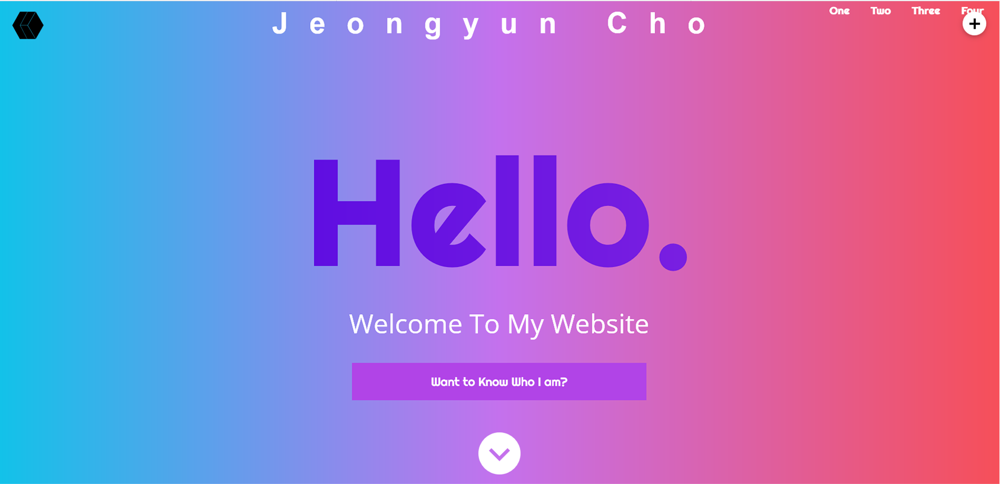
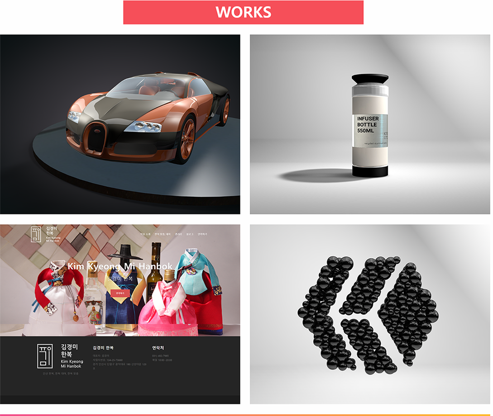
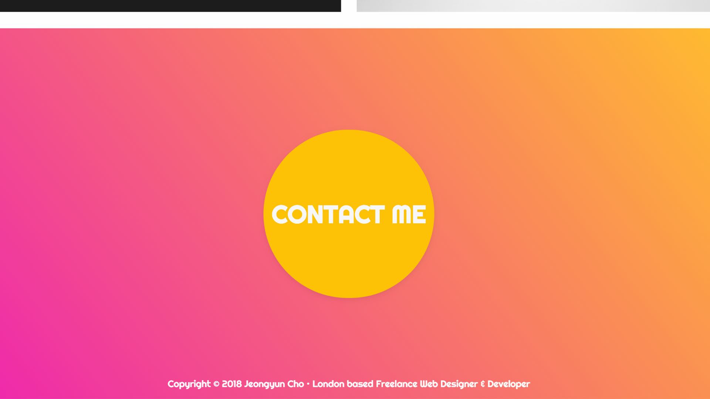
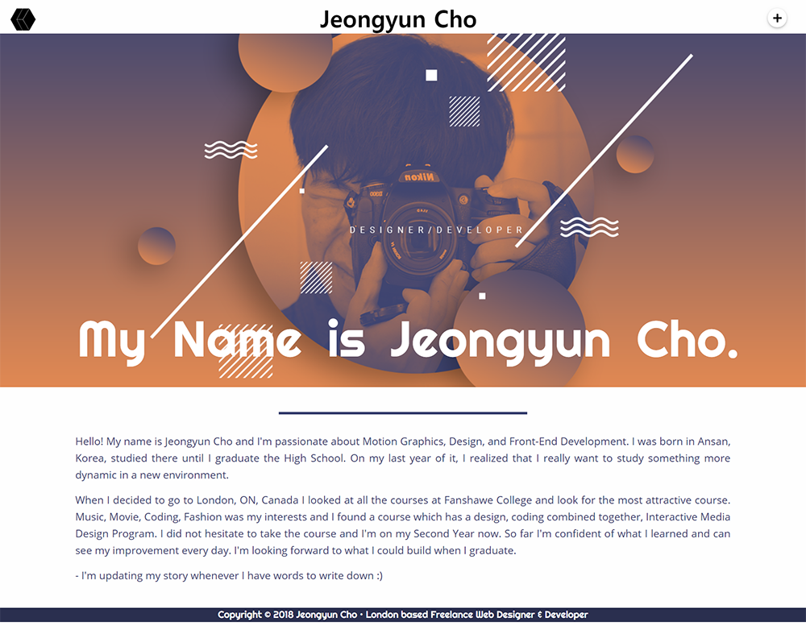
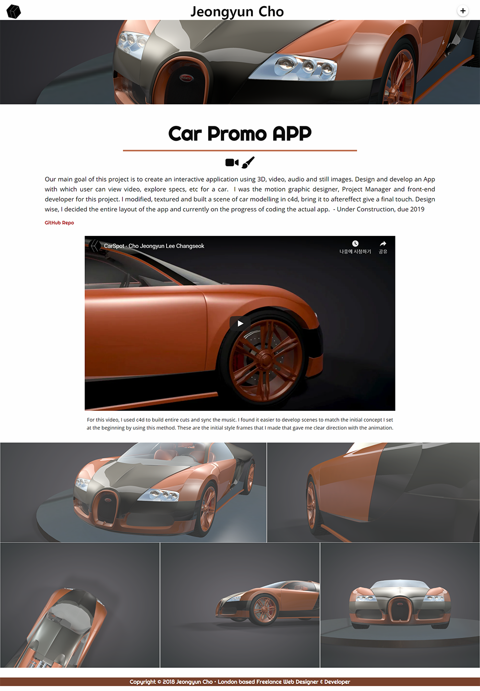

# Cho Jeongyun Final Integrated Project
http://jeongyuncho.ca/ 

The site is built to showcase my works that was done in previous year and also for the ones I want to put that will be done later.
I used gradient colors to catch users attention with black and white to help user to navigate.

      
The work section on index page shows thumbnail of my works and help to navigate to detail work page.

For the contact section I implented an animation which when you click the circle, the contact form will pop up.

About Page is where I will continuously update my story of coding and designing. 

Work Page shows detail of the work I worked on it also shows video, url to github. More works will be added later on.

## Built With

* [Foundation 6](https://foundation.zurb.com/sites.html) - The web framework used - Zurb Foundation 6 for sites
* [Git](https://git-scm.com/) Used for versioning.
* [Vue.js](https://vuejs.org/) to fetch database and put on html.
* [PHP/MySQL] to build database of the site.
* [Gulp.js](https://gulpjs.com/) Used sass, serve with Gulp
* [SASS](https://sass-lang.com/) Sass to manipulate CSS.
* [GreenSock](https://greensock.com/) - for animations of svg, text and image.
* [npm](https://www.npmjs.com/) npm compiled and install packages.
* [waypoints](http://imakewebthings.com/waypoints/) to trigger function on scroll to certain point.

## Authors

This project is entirely built by myself.

* **JeongYun Cho (Sam)** - *Developer,Designer*

## Acknowledgments

* images on google
* pinterest (https://www.pinterest.ca/)
* awwwards (https://www.awwwards.com/)
* previous work from graduated students

## Future Developments

* More works will be added
* Script of about page will be updated
* Images of the sites could be modified better.
* Overall user experience can be improved will adding or removing animations of the website.

